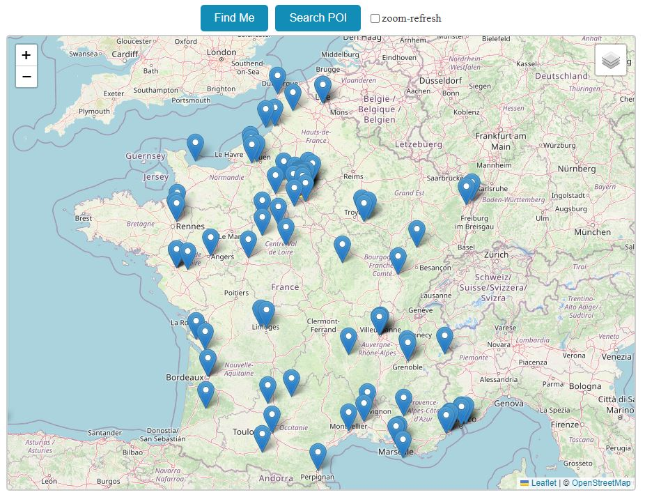

# Playing with Geospatial location

- In this repository, I had some fun working with geospatial location
- The application is quite simple: just a map for Points of Interest
- I used LeafletJS with OpenStreetMap and Google Maps
- For database solutions, you can choose from various implementations in [Program.cs](GeospatialWeb/Program.cs)
  - Azure Cosmos | Mongo | Redis | Postgres with EF
- You can find the following geospatial queries
  - Find POIs by distance
  - Find POIs within screen/map bounds, which determines whether a stored location falls inside a given polygon (screen)
  - Find countries based on the center of the map, determining whether a given point (center) lies within a polygon (country boundaries)

## Resources

#### 🍃 `Leaflet`

- [Leaflet.js](https://leafletjs.com)
- [LeafletForBlazor](https://github.com/ichim/LeafletForBlazor-NuGet) 👤*Laurentiu Ichim*
- Extensions
  - [Routing machine](https://www.liedman.net/leaflet-routing-machine)
  - [Overpass API](https://overpass-turbo.eu) 📓*Retrieving data (POIs) from OpenStreetMap*
  - [Turf.js](https://turfjs.org) - *Advanced geospatial analysis*

#### 🗺️ `Google Maps`

- [Maps Platform](https://developers.google.com/maps) | [Cloud Console](https://console.cloud.google.com/google/maps-apis)
- JavaScript API: [Samples](https://developers.google.com/maps/documentation/javascript/examples) | [Reference](https://developers.google.com/maps/documentation/javascript/reference)
- Getting started 📽️ [Create a billing account](https://youtu.be/uINleRduCWM?list=PL2rFahu9sLJ0yio9sC7BclL4a9r76ygHi) | [Enable APIs and SDKs](https://youtu.be/n1UorU1PALk?list=PL2rFahu9sLJ0yio9sC7BclL4a9r76ygHi) | [Generate and restrict API keys](https://youtu.be/2_HZObVbe-g?list=PL2rFahu9sLJ0yio9sC7BclL4a9r76ygHi)
- [Integrating Google Maps with Blazor and JS](https://youtu.be/ClNHH87sDM0) 📽️*41 min - Keep it simple, stupid*

#### 🗃️ `Cosmos`

- [Geospatial data](https://learn.microsoft.com/en-us/azure/cosmos-db/nosql/query/geospatial) 📚*MS-Learn*
- [Index and query location data](https://learn.microsoft.com/en-us/azure/cosmos-db/nosql/how-to-geospatial-index-query) 📚*MS-Learn*
- [Playing with Azure CosmosDB](https://github.com/19balazs86/AzureCosmosDB) 👤*My repository*

#### 🗃️ `Mongo`

- [Search Geospatially](https://www.mongodb.com/docs/drivers/csharp/current/fundamentals/geo) 📓*C#*
- [Geospatial indexes](https://www.mongodb.com/docs/drivers/csharp/current/fundamentals/indexes/#geospatial-indexes) 📓*C#*
- [Geospatial queries](https://www.mongodb.com/docs/manual/geospatial-queries) 📓*Manual - Mongo specific queries*
- [Playing with MongoDB](https://github.com/19balazs86/PlayingWithMongoDB) 👤*My repository*

#### 🗃️ `Redis`

- [Commands - Geo](https://redis.io/docs/latest/commands/?group=geo)

#### 🗃️ `Postgres`

- [NetTopologySuite - API Documentation](https://nettopologysuite.github.io/NetTopologySuite/api/NetTopologySuite.html)
- [Entity Framework - Spatial mapping](https://www.npgsql.org/efcore/mapping/nts.html) 📓*Npgsql*
- [Spatial type mapping](https://www.npgsql.org/doc/types/nts.html) 📓*Npgsql*
- [Spatial data](https://learn.microsoft.com/en-us/ef/core/modeling/spatial) 📚*MS-learn*

#### ✨ `Miscellaneous`

- [OpenStreetMap](https://www.openstreetmap.org)
- [GeoJSON.io](https://geojson.io)
- [geoBoundaries](https://www.geoboundaries.org/index.html)

## Comparison summary
- **Redis**: Fast for in-memory operations but could be limited by memory for large datasets. Complex geospatial queries and Polygon types are not supported. Better for real-time applications with smaller datasets.
- **Cosmos**: Highly scalable and efficient for large, distributed datasets, complex geospatial queries.
- **Mongo**: Good performance and scalability, complex geospatial queries. The names for geo types are a bit long and a bit difficult to create, but extension methods can help.
- **Postgres**: Good performance, handles complex geospatial queries with EF, making it easy to create and work with geo types.

## Screen

