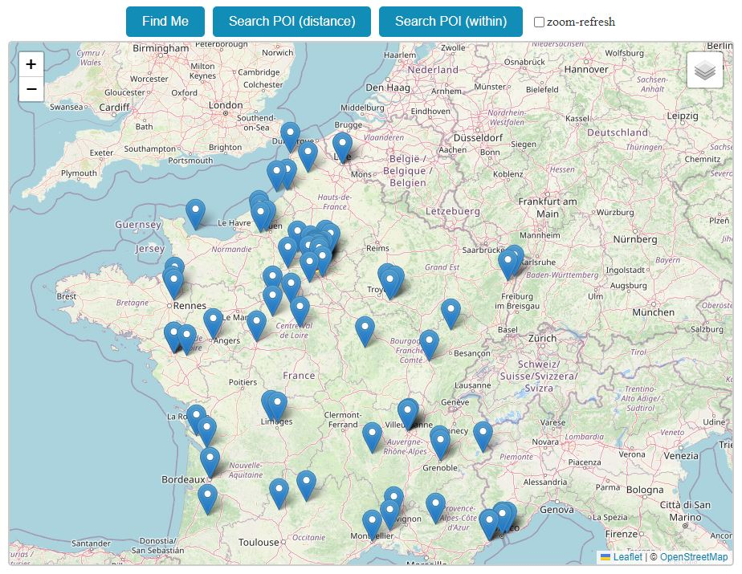

# Playing with Geospatial location

- In this repository, I had some fun working with geospatial location
- The application is quite simple: just a map for Points of Interest
- I used LeafletJS with OpenStreetMap, and the back end is powered by CosmosDB

## Resources

- [Leaflet.js](https://leafletjs.com) 📓
  - [LeafletForBlazor](https://github.com/ichim/LeafletForBlazor-NuGet) 👤*Laurentiu Ichim*
- CosmosDB
  - [Geospatial data](https://learn.microsoft.com/en-us/azure/cosmos-db/nosql/query/geospatial) 📚*MS-Learn*
  - [Index and query location data](https://learn.microsoft.com/en-us/azure/cosmos-db/nosql/how-to-geospatial-index-query) 📚*MS-Learn*
  - [Playing with Azure CosmosDB](https://github.com/19balazs86/AzureCosmosDB) 👤*My repository*
- Miscellaneous
  - [Turf.js](https://turfjs.org) 📓 - *Advanced geospatial analysis*
  - [GeoJSON.io](https://geojson.io) 📓

## Screen

